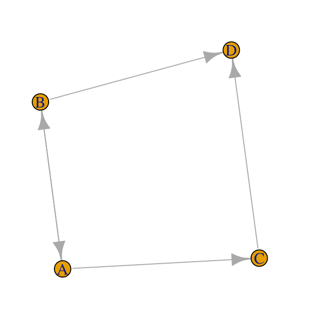
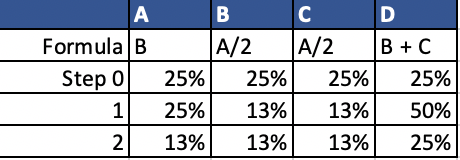
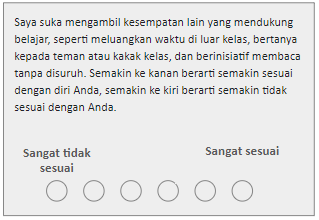
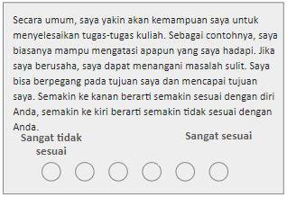

```{r setup, include=FALSE}
knitr::opts_chunk$set(echo = TRUE)
```

```{r xaringan-themer, include=FALSE, warning=FALSE}
library(xaringanthemer)
style_duo(
  primary_color = "#cbf7ed",
  secondary_color = "#23395b",
  text_color = "#000000",
  header_font_google = google_font("Josefin Sans"),
  text_font_google   = google_font("Montserrat", "300", "300i"),
  code_font_google   = google_font("Fira Mono"),
  base_font_size = "20px",
  text_font_size = "0.875rem",
  header_h1_font_size = "3.25rem",
  header_h2_font_size = "2.25rem",
  header_h3_font_size = "1.75rem",
)
```


```{r library-data, include=FALSE}
library(tidyverse)
library(igraph)
library(psych)
```

```{css, echo = FALSE}
.comment{ color: red; font-weight: bold;}
```

## Pengantar

.pull-left[
- Banyak tantangan bagi mahasiswa baru (maba), ditambah situasi PJJ dengan daring semakin membuat maba perlu menyesuaikan diri dengan lingkungan barunya
- Penyesuaian diri didorong oleh motivasi akademik, keinginan untuk sukses, setiap mahasiswa
- Motivasi akademik dibentuk oleh *personal initiative* (Tymon & Batistic, 2016) dan *self-efficacy* (Chemers, Hu, & Garcia, 2001)
- Jejaring sosial juga dapat mempengaruhi penyesuaian diri dan motivasi akademis mahasiswa (Gasevic, Zouaq, & Janzen, 2013). Namun belum banyak penelitian yang melihat bagaiamana inisiatif dan efikasi diri mempengaruhi interaksi antar mahasiswa dalam jejaring sosial
]
.pull-right[
Dua aspek yang dapat berkaitan dalam membentuk jejaring sosial yang berkualitas di sekolah/perkuliahan:
- *Personal Initiative* (Frese, Kring, Soose, & Zempel, 1996): Kecenderungan proaktif dan mandiri untuk bekerja yang melampaui apa yang secara formal diperlukan dalam pekerjaan tertentu
- *Self-efficacy* (Bandura, 1997): Keyakinan pada kemampuan seseorang untuk mengatur dan melaksanakan tindakan yang diperlukan untuk menghasilkan pencapaian tertentu
]

---

## Pengantar

### Pertanyaan Penelitian

.pull-left[
1. Bagaimana pengaruh *personal initiative* di kelas terhadap jejaring sosial mahasiswa kelas MRAD 2020?

2. Bagaimana pengaruh *self-efficacy* terhadap jejaring sosial mahasiswa kelas MRAD 2020?

Index jejaring sosial yang akan diperhatikan:
  - Betweenness centrality
  - PageRank centrality
]

.pull-right[
```{r, echo = F, fig.align = 'center', fig.width = 8, fig.cap="Ilustrasi Jejaring Sosial"}
knitr::include_graphics("gambar/Ilustrasi SNA.PNG")
```
]
---

## Indeks 1: Betweenness Centrality
Sejauh mana node berada pada jarak terpendek antara node-node lainnya, dengan kata lain menghitung bobot setiap node berdasarkan seberapa banyak sebuah node dilalui oleh dua node lain dalam graf berdasar jalur terpendeknya

**Rumus:**
$$BC(v)={\sum}_{u,v\epsilon v}{\frac {σuw(v)}{σuw}}$$
- σuw(v) = Jumlah jalur terpendek antara node u dan w yang melalui node v
- σuw = Jumlah jalur terpendek antara node u dan w
---
## Ilustrasi Betweenness Centrality

```{r Fig BC, echo = F, fig.align = 'left', fig.width = 8, fig.cap="Fig 1: Node C dan D memiliki betweenness centrality tertinggi"}
knitr::include_graphics("gambar/graph betweenness.PNG")
```


---
## Cara Mengkalkulasi Betweenness Centrality

.pull-left[

Misalkan jika ingin menghitung betweenness centrality dari node C dalam Fig 1,
1. Buat daftar semua kombinasi hubungan antar node (cth: A-B, A-D, A-E, dst.)
2. Hitung jumlah jalur terpendek antara kombinasi hubungan (cth: A-D ada 1 jalur terpendek), disebut X
3. Hitung jumlah jalur terpendek yang melewati C (cth: A-D harus melewati C), disebut Y
4. Untuk setiap kombinasi hubungan, hitung Y/X
5. Jumlahkan hasil kalkulasi Y/X untuk semua kombinasi hubungan, hasilnya adalah betweenness centrality C. 

]

.pull-right[
Hasil Kalkulasi Betweenness Node C
```{r Fig BC 2, echo = F, fig.align = 'left', fig.height=10, fig.cap = "Betwenness Centrality Node C adalah 6"}
knitr::include_graphics("gambar/tabel betweenness centrality.PNG")
```
]

---

## Indeks 2 : PageRank Centrality
Menentukan seberapa pentingnya suatu node, berdasarkan kualitas node yang menuju kearah node tersebut (Brin & Page, 1998)
- Untuk mendapat PageRank tinggi, satu node memerlukan (Bruun & Brewe, 2013):
  - Banyak hubungan untuk menujunya, atau
  - Beberapa hubungan yang masing-masing memiliki banyak hubungan untuk menujunya
- Memperhatikan arah hubungan, hubungan yang mengarah pada satu node (indegree) memperkuat PageRank; hubungan dari node yang sama ke node lain tidak
- Node dengan PageRank tinggi tidak harus populer, atau memiliki banyak hubungan langsung
Pada figur 1 di bawah, node D memiliki PageRank tertinggi1

**Rumus:**

$$PR(u)={\sum}_{v\epsilon Bu}{\frac {PR(v)}{L(v)}}$$
- PageRank node u bergantung pada PageRank node v dalam set Bu (set mengandung semua node dengan hubungan masuk ke node u), dibagi dengan jumlah hubungan keluar (links) dari node v.
- Hasil dalam bentuk persentase

---
### Ilustrasi PageRank Centrality
```{r Fig PR, echo = F, fig.align = 'left', out.width = "55%", fig.cap="Fig 2: Node D memiliki PageRank Tertinggi"}

```
---

## Cara Mengkalkulasi Pagerank Centrality

.pull-left[

Misalkan jika ingin menghitung pagerank centrality untuk node D dalam Fig 2,
1. Berawal dengan asumsi bahwa semua node memiliki pagerank sama: 1/4 atau 25%
1. Mengidentifikasi node yang dapat masukan interaksi dari node lainnya 
 - D menerima masukan dari B dan C
1. Menghitung jumlah interaksi yang dimulai node B & C 
 - Hanya ada 1 interaksi yang dimulai B dan C
1. Menghitung jumlah interaksi dari B & C yang masuk ke D
 - 1/1 untuk B; 1/1 untuk C
1. Formula pagerank untuk node D adalah C + D
  - C + D = 25% + 25 % = 50%
1. Ulangi langkah 1-4 dengan pagerank baru (50%) sampai hasil konsisten

]

.pull-right[
Hasil Kalkulasi Betweenness Node C

```{r Figure 4, echo = F, fig.align = 'left', fig.height=10}

```
]

---
## Variabel 1: **Personal Initiative**

### Hipotesis
.pull-left[
- H1a: *personal initiative* berhubungan positif dengan _betwenness centrality_. Semakin tinggi *personal initiative* mahasiswa MRAD 2020, maka semakin tinggi *betweeness centrality*-nya pada jaringan akademik

- H1b: *personal initiative* berhubungan positif dengan _pagerank centrality_. Semakin tinggi *personal initiative* mahasiswa MRAD 2020, maka semakin tinggi *pagerank centrality*-nya pada jaringan akademik

]
.pull-right[
- H1c: Hubungan antar *personal initiative* dengan _betwenness centrality_ dimoderasi oleh jenis kelamin pada jaringan akademik

- H1d: Hubungan antar *personal initiative* dengan _pagerank centrality_ dimoderasi oleh jenis kelamin pada jaringan akademik
]

---
## Variabel 1: **Personal Initiative**  
### Rationale

#### Pengaruh Inisiatif terhadap Betweenness & PageRank Centrality
- *Personal initiative* dapat membantu pencapaian tujuan pembelajaran, seperti mencari cara-cara baru untuk menyelesaikan tugas (Wollny, Fay, & Urbach, 2016)
- Li dan Stone (2018) menunjukkan bahwa *betweenness dan pagerank centrality* motivasi akademik secara signifikan berhubungan positif dengan centrality siswa
- Sebaliknya, mahasiswa berinisiatif seharusnya menarik perhatian maba lainnya karena terlihat kompeten

#### Jenis Kelamin sebagai Moderator
* Sulit bagi wanita untuk mencapai posisi kepemimpinan karena ekspektasi masyarakat terhadap mereka sebagai pengurus rumah tangga (Kubu, 2018)
* Centrality tinggi:indikasi tingat pengaruh (i.e. leadership) yang dimiliki seseorang
  * Inisiatif tinggi dalam bidang akademik dapat ditolak oleh rekan-rekannya
* Di Indonesia stereotipe ini juga ditekankan dalam sekolah-sekolah dasar (Setyono, 2018)
* Dalam perguruan tinggi ada indikasi bahwa pemimpin wanita dapat lebih diterima (Nurmila, 2017)
* Inisiatif akan memiliki pengaruh positif yang lebih kuat terhadap pria dibanding wanita

---

## Variabel 2: **Self-efficacy**

### Hipotesis
- **H2a**: *self-efficacy* berhubungan positif dengan _betwenness centrality_. Semakin tinggi *self-efficacy* mahasiswa MRAD 2020, maka semakin tinggi *betweeness centrality*-nya pada jaringan akademik

- **H2b**: Hubungan antara *self-efficacy* dengan _betweenness centrality_ dimoderasi oleh jurusan S1. Hubungan *self-efficacy* dengan _betweenness centrality_ semakin meningkat terutama pada mahasiswa yang memiliki latar belakang keilmuan S1 yang sama dengan jejang S2, yaitu Psikologi

- **H2c**: Hubungan antara *self-efficacy* dengan _betweenness centrality_ dimoderasi oleh asal universitas ketika S1. Hubungan *self-efficacy* dengan _betweenness centrality_ semakin meningkat terutama pada mahasiswa yang memiliki latar belakang kampus yang sama dengan yang ditempuh saat S2, yaitu mahasiswa yang berasal dari Universitas Indonesia

- **H2d**: Terdapat perbedaan antara mahasiswa laki-laki dan perempuan pada pengaruh *self-efficacy* dalam hubungan daya tarik fisik lawan jenis dan degree centrality pada interaksi jaringan akademik.

---
## Variabel 2: **Self-efficacy**

### Rationale
#### Pengaruh Efikasi Diri terhadap Betweenness Centrality

- Schunk (1991) mengatakan bahwa *self-efficacy* merupakan salah satu *personal expectancy* dalam motivasi akademik → *expectancy* dapat mempengaruhi tingkah laku, usaha, dan persitensi. Terdapat bukti bahwa *self-efficacy* memprediksi pencapaian akademik (Bandura, 1986) 
- Li dan Stone (2018) menunjukkan bahwa motivasi akademik secara signifikan berhubungan dengan centrality siswa, salah satunya *betweenness centrality*. 
- Latar belakang/pengalaman sebelumnya juga memiliki pengaruh pada hubungan *self-efficacy* dan jarinagan akademik (betwenness centrality)
  - Self-efficacy dibentuk oleh pencapaian akademis yang pernah ditempuh sebelumnya (Chemers et al., 2001). Mahasiswa yang memiliki self-efficacy yang tinggi akan terlihat percaya diri akan kemampuannya.
  - Individu yang terlihat percaya diri akan kemampuannya akan berdampak pada persepsi mahasiswa lainnya sebagai seseorang yang mampu dan memiliki kemauan belajar. 
  - Menurut Dou (2017), persepsi siswa satu dengan lainnya akan mempengaruhi perkembangan sentralitas jaringan sosial mereka.
  
---
## Variabel 2: **Self-efficacy**

### Rationale

#### Jurusan dan Universitas S1 sebagai Moderator
  - Familiaritas berasosiasi positif dengan efikasi diri (Gist dan Mitchell, 1992; Kelly et al. 2015) 
  - Maba yang berada dalam lingkungan tidak *familiar* seharusnya mencari dukungan dari orang yang lebih familiar dengan lingkungannya
  - Jurusan dan universitas saat S1 dapat menjadi bentuk familiaritas dari perkuliahan S2
  
#### Daya Tarik sebagai Moderator
- Temuan studi Reis, dkk. (1982) ini juga menunjukkan bahwa social competence memiliki pengaruh pada daya tarik fisik dengan pola interaksi laki-laki. Pada wanita, efek kompetensi sosial pada interaksi sosial terbukti berlawanan dengan daya tarik, menunjukkan bahwa mereka memiliki pengaruh independen (terpisah).
- Self-efficacy dapat dikatakan sebagai salah satu bentuk social competence
 - Kompetensi sosial berhubungan dengan peningkatan kesiapan sekolah (Joy, 2015)
 - Self-efficacy merupakan bentuk keyakinan diri akan menghadapi tugas maupun pembelajaran sehingga siap menghadapi sekolah.
  
---

## Metode
.pull-left[
### Responden
Mahasiswa S2 Sains di kelas Metode Riset & Analisis Data Kuantitatif 2020
- n = 20 
- Jenis Kelamin = Perempuan (n = 18), Laki-laki (n = 2) 
- Peminatan = Sosial (n = 6), Psikologi Industri dan Organisasi (n = 8), Pendidikan (n = 4), Perkembangan (n = 2)
]
.pull-right[
### Prosedur Penelitian
- Peneliti bertemu partisipan secara daring melalui aplikasi zoom
- Peneliti menjelaskan gambaran umum penelitian
- Peneliti membagikan google form 
- Partisipan mengisi formulir informed consent, data diri, dan instrumen alat ukur
- Peneliti menjelaskan formulir diari interaksi termasuk tata cara pengisiannya
- Partisipan mengisi diari interaksi setiap hari selama 7 hari  
  (Tim peneliti akan mengirimkan pesan pengingat kepada partisipan setiap hari)
]
---
## Metode
### Instrumen
.pull-left[
#### Item *Personal Initiative*
  
```{r itemini, echo = F, fig.align = 'left', out.width = "900px"}

```
]

.pull-right[
#### Item *Self-Efficacy*
  
```{r itemefik, echo = F, fig.align = 'left', out.width = "900px"}

```
]

**Catatan**: Saat menganalisis data, skor item diberi nilai dari 1 - 6, di mana 1 berarti sangat tidak sesuai dan 6 berarti sangat sesuai.
---
## Metode
### Prosedur Analisis Data
  
- Menyusun data dictionary, koding, & data cleaning
- Menghitung skor Betweenness Centrality (BC) & PageRank Centrality (PR) menggunakan paket R igraph
- Uji regresi* linear
  - Skor inisiatif untuk belajar dengan skor BC dan PR
  - Skor efikasi diri dalam kelas dengan skor PR
- Uji moderator*: regresi linear termoderasi
  - Skor inisiatif dimoderasi oleh jenis kelamin
  - Skor efikasi diri dimoderasi oleh jurusan S1 dan universitas S1


- **Prediktor:** inisiatif & efikasi diri
- **Moderator:** jenis kelamin, jurusan S1, universitas S1  
- **Outcome:** BC dan PR.

.footnote[*) taraf signifikansi p < 0.1]
---
## Membuat Dataframe Vertexlist
```{r vmrad1, include=T}
vmrad <- read.csv("vmrad.csv", header=TRUE)
# header=TRUE --> baris pertama dibaca sebagai header
str(vmrad) # Melihat struktur data
```

---
## Membuat Dataframe Edgelist

#### Edgelist Akademik

```{r emrada}
emrada <- read.csv("emrada.csv", header=TRUE)
str(emrada)
```


Objek Igraph Akademik

```{r gmrada}
gmrada <- graph_from_data_frame(emrada, vertices = vmrad, directed=T) 
gmrada <- set_edge_attr(gmrada, name = "weight", value = E(gmrada)$tota) # membuat atribut edge weight untuk memudahkan analisis centrality
gmrada <- delete_edges(gmrada, which(E(gmrada)$weight == 0)) # menghapus edge dengan nilai 0
```

---
## Membuat Dataframe Edgelist

#### Edgelist Non-Akademik
```{r emradnon}
emradnon <- read.csv("emradnon.csv", header=TRUE)
str(emradnon)
```
Objek Igraph Non-Akademik

```{r gmradnon}
gmradnon <- graph_from_data_frame(emradnon, vertices = vmrad, directed=T) 
gmradnon <- set_edge_attr(gmradnon, name = "weight", value = E(gmradnon)$totn) 
gmradnon <- delete_edges(gmradnon, which(E(gmradnon)$weight == 0)) 
```


---
## Analisis Deskriptif Jaringan
.pull-left[
### 1. Size
Total seluruh edges (interaksi) dalam jaringan
```{r dsize}
gsize(gmrada) 
gsize(gmradnon)
```

]

.pull-right[
### 2. Density 
Perbandingan total edge dengan maksimal edge yang dapat terbentuk
```{r ddensity}
round(edge_density(gmrada)*100,2)
round(edge_density(gmradnon)*100,2)
```
]

#### Komentar
- Mahasiswa 4 kali lebih sering berinteraksi mengenai masalah akademik dibanding non-akademik.
- Mahasiswa berinteraksi dengan 4 kali lebih banyak mahasiswa lainnya mengenai masalah akademik 
- Kebanyakan mahasiswa menjalin hubungan sebatas hubungan kolega.
---
## Analisis Deskriptif Jaringan
### 3a. Diameter & Mean Distance Jaringan Akademik

Jarak terpendek antara dua nodes terjauh dalam jaringan
```{r ddiameteraka}
diameter(gmrada, weights = NA)
cat("Jalur diameter=", get_diameter(gmrada, weights =NA))
```

#### Komentar
- Nodes terjauh jaringan akademik: node 9 (Perkembangan) ke node 1 (PIO)

---
## Analisis Deskriptif Jaringan

### 3a. Diameter & Mean Distance Akademik

```{r colorscheme, echo = F}
color.sex <- c("lightskyblue", "hotpink")
color.peminatan <- c("plum", "rosybrown", 
                     "skyblue", "peachpuff") 
V(gmrada)$color.sex <- color.sex[V(gmrada)$sex] 
V(gmradnon)$color.sex <- color.sex[V(gmrada)$sex]
V(gmrada)$color.peminatan <- color.peminatan[V(gmrada)$peminatan]
V(gmradnon)$color.peminatan <- color.peminatan[V(gmrada)$peminatan] 
```


```{r ddiamterakagraf, echo=F, fig.align='center', fig.height=6, fig.width=11}
E(gmrada)$color <- "grey60"
E(gmrada)$width <- 1
E(gmrada, path = unlist(get_diameter(gmrada, weights = NA)))$color <- "tan1"
E(gmrada, path = unlist(get_diameter(gmrada, weights = NA)))$width <- 3
par(mar = c(4, 1, 3, 1), bg = "seashell")
plot(gmrada, edge.arrow.size=.2,
     vertex.color = V(gmrada)$color.peminatan,
     layout = layout_with_fr(gmrada),
     main = "Visualisasi Diameter Jaringan Akademik")
legend('bottomleft', 'Jalur 2 Node Terjauh', 
       lty=1, col='black', lwd = 3, 
       box.lty = 0, xpd = T, inset = c(0,-0.15), pt.cex=2, cex=.8)
legend('bottomright', c("Psikologi Sosial","Psikologi Perkembangan", 
                        "Psikologi Industri dan Organisasi", 
                        "Psikologi Pendidikan"), pch=21,
       pt.bg = color.peminatan, pt.cex=2, cex=.8, bty="n",
       xpd = T, inset = c(0,-0.15))
```
---
## Analisis Deskriptif Jaringan

### 3a. Diameter & Mean Distance Akademik
```{r}
mean.dist.aka<-round(mean_distance(gmrada), 2)
cat("Mean distance=", 
    mean.dist.aka)
```

#### Komentar
- Rata-rata setiap node harus melewati 1 - 2 node lain untuk saling berinteraksi
- Untuk mengetahui apakah jaringan ini memiliki mean distance yang normal, harus dibandingkan dengan jaringan sosial lain yang serupa
- Erdos-renyi game dapat mensimulasi jaringan sosial serupa secara acak, sehingga dapat dilakukan perbandingan

---
## Analisis Deskriptif Jaringan

### Erdos-Renyi Game

Membanding mean distance jaringan akademik kelas MRAD 2020 dengan 1.000 jaringan sosial *random* dengan density yang sama (~39.5%).
<ol>
<li> Membuat daftar yang berisi 1.000 item
</ol>

```{r}
gmrada.list <- vector('list',1000)
```

<ol start = 2>
<li> Mengisi setiap item dengan jaringan sosial yang dibuat secara acak
</ol>

```{r}
for(i in 1:1000){gmrada.list[[i]] <- 
  erdos.renyi.game(n = gorder(gmrada),
                   p.or.m = edge_density(gmrada), 
                   type = "gnp")} 
```
---
## Analisis Deskriptif Jaringan

### Erdos-Renyi Game
<ol start = 3>
<li> Mengaplikasikan formula mean_distance kepada setiap jaringan sosial ciptaan
```{r}
gmrada.erd <- unlist(lapply(gmrada.list, mean_distance, directed = T)) 
```

<li> Membandingkan mean distance jaringan akademik dengan mean distance jaringan buatan
```{r}
mean(gmrada.erd< mean_distance(gmrada))
```

#### Komentar
Mean distance jaringan akademik MRAD lebih tinggi dari >95% jaringan lain, mengindikasikan keterhubungan sangat rendah untuk density jaringan ini

---
## Analisis Deskriptif Jaringan

```{r,fig.width= 11, fig.height=6, echo=F}
tema <- theme(panel.background = element_rect(fill = "linen"), 
              plot.title = element_text(size = 16, face = "bold"))

gmrada.erd.df <- data.frame(gmrada.erd)

ggplot(gmrada.erd.df, aes(gmrada.erd)) +
  geom_histogram(bins = 40) +
  geom_vline(xintercept = mean_distance(gmrada), 
             color = "red", linetype = "dashed", size = 1) +
  labs(title = "Persebaran Erdos Renyi Game (1000x)", 
       subtitle = "Jaringan Akademik",
       x = "Mean Distance", y = "Frekuensi") +
  geom_text(x = mean_distance(gmrada) + 0.05, 
            y = 80, label= "Mean Dist. Aktual", size = 3) +
  tema
```

---

## Analisis Deskriptif Jaringan
### 3b. Diameter & Mean Distance Non-Akademik
```{r ddiameternon}
diameter(gmradnon, weights = NA)
cat("Jalur diameter=", get_diameter(gmradnon, weights =NA))
```

- Keterhubungan pada jaringan non-akademik terlihat lebih rendah

- Nodes terjauh jaringan akademik: node 5 (PIO) ke node 9 (Perkembangan)

---
## Analisis Deskriptif Jaringan

### 3b. Diameter & Mean Distance Non-Akademik

```{r ddiameternongraf, echo=F, fig.height = 6, fig.width=11, fig.align = 'center'}
E(gmradnon)$color <- "grey60"
E(gmradnon)$width <- 1
E(gmradnon, path = unlist(get_diameter(gmradnon, weights = NA)))$color <- "tan1"
E(gmradnon, path = unlist(get_diameter(gmradnon, weights = NA)))$width <- 3
par(mar = c(4, 1, 3, 1), bg = "seashell")
plot(gmradnon, edge.arrow.size=.2,
     vertex.color = V(gmradnon)$color.peminatan,
     layout = layout_with_gem(gmradnon),
     main = "Visualisasi Diameter Jaringan Non-Akademik")
legend('bottomleft', 'Jalur 2 Node Terjauh', 
       lty=1, col='black', lwd = 3, 
       box.lty = 0, xpd = T, inset = c(0,-0.15), pt.cex=2, cex=.8)
legend('bottomright', c("Psikologi Sosial","Psikologi Perkembangan", 
                         "Psikologi Industri dan Organisasi", 
                         "Psikologi Pendidikan"), pch=21,
       pt.bg = color.peminatan, pt.cex=2, cex=.8, bty="n",
       xpd = T, inset = c(0,-0.15))
```
---
## Analisis Deskriptif Jaringan

### 3b. Diameter & Mean Distance Non-Akademik
.pull-left[
#### Mean Distance
```{r, echo =F}
mean.dist.non <-round(mean_distance(gmradnon), 2)
cat("Mean distance=", mean.dist.non)
```
- Jaringan non-akademik, interaksi rata-rata harus melewati 2 node
  - Dalam jaringan akademik rata-rata hanya melewati 1 node
  ]
  
.pull-right[
#### Erdos-Renyi Game

```{r, echo = F}
gmradnon.list <- vector('list',1000)

for(i in 1:1000){
  gmradnon.list[[i]] <- erdos.renyi.game(n = gorder(gmradnon), 
                                         p.or.m = edge_density(gmradnon), 
                                         type = "gnp") 
}

gmradnon.erd <- unlist(lapply(gmradnon.list, mean_distance, directed = T))
mean(gmradnon.erd< mean_distance(gmradnon))
```

Jaringan non-akademik memiliki keterhubungan yang lebih normal (sekitar 65% di atas semua jaringan buatan) untuk jaringan dengan density ~10%
]
---
## Analisis Deskriptif Jaringan

```{r, echo = F, fig.height = 6, fig.width=11, fig.align = 'center'}
gmradnon.erd.df <- data.frame(gmradnon.erd)

ggplot(gmradnon.erd.df, aes(gmradnon.erd)) +
  geom_histogram(bins = 40) +
  geom_vline(xintercept = mean_distance(gmradnon), 
             color = "red", linetype = "dashed", size = 1) +
  labs(title = "Persebaran Erdos Renyi Game (1000x)",
       subtitle = "Jaringan Non-Akademik",
       x = "Mean Distance", y = "Frekuensi") +
  geom_text(x = mean_distance(gmradnon) + 0.45, 
            y = 80, label= "Mean Dist. Aktual", size = 3) +
  tema
```
---
## Analisis Deskriptif Jaringan
### 4. Komponen
Jumlah kumpulan nodes yang saling terhubung (tidak terpencar)

```{r dcomponentsaka}
components(gmrada)$no
```

```{r dcomponentsnon}
components(gmradnon)$no
```
 
Semua node dalam jaringan akademik maupun non-akademik terhubung, baik langsung/tidak langsung.

---
## Analisis Deskriptif Jaringan
### 5a. Cluster Akademik

Sub-jaringan yang berisi nodes yang saling terkoneksi satu sama lain

Cluster Akademik
```{r dclusteraka}
gmrada.c <- cluster_louvain(as.undirected(gmrada)) 
sizes(gmrada.c)
```

#### Komentar
- Jaringan akademik terbagi menjadi 4 cluster sesuai peminatan
- Peminatan memfasilitasi diskusi akademik
  - Lebih banyak kelas dalam peminatan yang sama dibanding kelas lintas peminatan.

---
## Analisis Deskriptif Jaringan

```{r vizclusteraka, fig.height = 6, fig.width=11, fig.align = 'center', echo=F}
par(mar = c(4, 1, 3, 1), bg = "seashell")
plot(gmrada.c, 
     gmrada, 
     edge.arrow.size=.3, 
     edge.width = 1.2,
     col = V(gmrada)$color.peminatan,
     main= "Grafik Komunitas Jaringan Akademik")
legend(x=-1.5, y=-1.1, c("Psikologi Sosial","Psikologi Perkembangan", 
                         "Psikologi Industri dan Organisasi", 
                         "Psikologi Pendidikan"), pch=21,
       pt.bg = color.peminatan, pt.cex=2, cex=.8, bty="n")
```

---
## Analisis Deskriptif Jaringan
### 5b. Cluster Non-Akademik

```{r dclusternon}
gmradnon.c <- cluster_louvain(as.undirected(gmradnon))
sizes(gmradnon.c)
```

#### Komentar
- Interaksi non-akademik tidak berkelompok berdasarkan peminatan. 
- Mungkin terjadi karena mahasiswa sudah saling kenal sebelum memilih peminatan
  - Node 12 dan 19 sudah menikah
  - Node 8, 16 dan 17 berasal dari jurusan S1 non-psikologi, kemungkinan sudah saling kenal saat kelas matrikulasi.

---
## Analisis Deskriptif Jaringan

```{r vizclusternon, fig.height = 6, fig.width=11, fig.align = 'center', echo=F}
par(mar = c(4, 1, 3, 1), bg = "seashell")
plot(gmradnon.c, 
     gmradnon, 
     edge.arrow.size=.3,  
     edge.width = 1.2,
     col = V(gmradnon)$color.peminatan, 
     main= "Grafik Komunitas Jaringan Non-Akademik")
legend(x=-1.5, y=-1.1, c("Psikologi Sosial","Psikologi Perkembangan", 
                         "Psikologi Industri dan Organisasi", 
                         "Psikologi Pendidikan"), pch=21,
       pt.bg = color.peminatan, pt.cex=2, cex=.8, bty="n")
```

---

## Analisis Deskriptif *Personal Inisiative* dan *Self-Efficacy* (Prediktor)
.pull-left[
#### Distribusi Data Inisiatif
```{r deskini, fig.width=9, fig.height=8, echo=F}
hist(vmrad$inisiatif, xlab = "inisiatif")
```
]

.pull-right[
#### Distribusi Data Efikasi
```{r deskefika, fig.width=9, fig.height=8, echo=F}
hist(vmrad$efikasi, xlab = "self-efficacy")
```
]

Variabel inisiatif dan self-efficacy tidak terdistribusi dengan normal, namun menurut Habeck dan Brickman (2014) mengatakan bahwa uji hipotesis dengan menggunakan analisis regresi masih bisa dilakukan dengan data yang tidak terdistribusi normal

---
## Analisis Deskriptif Betweenness & PageRank Centrality (Outcome)
### Betweenness Centrality 

```{r, echo = 1}
bet.aka <- round(betweenness(gmrada),2)
bet.non <- round(betweenness(gmradnon),2)
```

```{r deskbet}
head(sort(bet.aka, decreasing = T),10)
```

#### Komentar
- Density rendah untuk jaringan akademik (~40%) menjelaskan mengapa beberapa node memiliki BC yang jauh lebih tinggi daripada yang lainnya

---
## Analisis Deskriptif Betweenness & PageRank Centrality (Outcome)

```{r, echo = F, fig.height = 6, fig.width=11, fig.align = 'center'}
par(mar = c(4, 1, 3, 1), bg = "seashell")
plot(
  gmrada, 
  vertex.size=bet.aka/3 + 5,  
  edge.arrow.width = 1, 
  vertex.label.color="black", 
  edge.color = "dimgrey",
  edge.arrow.size=.2, 
  vertex.color = V(gmrada)$color.sex, 
  layout = layout_with_fr(gmrada),
  main = "Visualisasi Betweenness Centrality",
  sub="Interaksi Akademik"
)
legend(x=-1.5, y=-1.1, c("Pria", "Wanita"), pch=21,
       pt.bg = color.sex, pt.cex=2, cex=.8, bty="n")
```

---

## Analisis Deskriptif Betweenness & PageRank Centrality (Outcome)
### PageRank Centrality
```{r, echo = 1}
pr.aka <- round(page_rank(gmrada)$vector*100, 2)
pr.non <- round(page_rank(gmradnon)$vector*100, 2)
```

```{r deskpr}
head(sort(pr.aka, decreasing = T),10)
```

#### Komentar  
- Node 19 memilikie BC dan PR paling tinggi untuk jaringan akademik, berhubungan dengan posisinya sebagai ketua kelas dan angkatan

---

## Analisis Deskriptif Betweenness & PageRank Centrality (Outcome)

```{r, echo = F, fig.height = 6, fig.width=11, fig.align = 'center'}
par(mar = c(4, 1, 3, 1), bg = "seashell")
plot(
  gmrada, 
  vertex.size=pr.aka*3, 
  vertex.label.color="black", 
  edge.arrow.size=.2,
  edge.color = "dimgrey",
  vertex.color = V(gmrada)$color.peminatan, 
  layout = layout_with_fr(gmrada),
  main = "Visualisasi PageRank Centrality",
  sub = "Interaksi Akademik"
)
legend(x=-1.5, y=-1.1, 
       c("Psikologi Sosial","Psikologi Perkembangan", 
         "Psikologi Industri dan Organisasi", 
         "Psikologi Pendidikan"), pch=21,
       pt.bg = color.peminatan, pt.cex=2, cex=.8, bty="n")
```
---
## Uji Hipotesis

### Persiapan Uji Hipotesis

```{r persiapaujih}
vmrad$bet.aka <- bet.aka
vmrad$pr.aka <- pr.aka
vmrad$bet.non <- bet.non
vmrad$pr.non <- pr.non
vmrad$sex <- as.factor(vmrad$sex)
vmrad$jurusans1 <- as.factor(vmrad$jurusans1)
vmrad$univs1 <- as.factor(vmrad$univs1)
```

Variabel berikut diubah menjadi variabel categorical untuk melakukan analisis statistik:
- Sex (**Catatan**: 1 = Pria; 2 = Wanita)
- Jurusan S1 (**Catatan**: 1 = Psikologi; 2 = Non-Psikologi)
- Universitas S1 (**Catatan**: Variabel akan dimodikifasi di slide berikut)

Variabel centrality dimasukkan dalam dataframe VMRAD untuk memudahkan analisis:
- betweenness centrality (bet.aka; bet.non)
- pagerank centrality (pr.aka; pr.non)

---
## Uji Hipotesis

### Persiapan Uji Hipotesis

.pull-left[
#### Modifikasi Variabel Universitas S1
- Terdapat banyak pilihan universitas S1
- Hipotesis kami hanya membedakan antara S1 UI dan non-UI
- Variabel univs1 akan diubah menjadi 1 = UI, 2 = non-UI
```{r}
head(vmrad$univs1)
```

]

.pull-right[
#### Hasil Modifikasi Variabel
```{r}
vmrad$univs1new <- ifelse(vmrad$univs1 == "1", "1","2")
head(vmrad$univs1new)
```
]

---

## Uji Hipotesis

#### Pengaruh Inisiatif terhadap Betweenness Centrality (H1a)

```{r ujih1a}
inisa.bet <- lm(bet.aka ~ inisiatif, data = vmrad)
summary(inisa.bet)$coeff
```
#### Komentar
- Hipotesis 1a ditolak.  
- *Personal initiative* mahasiswa tidak memiliki hubungan positif dengan betweenness centrality. 

---
## Uji Hipotesis

#### Pengaruh Inisiatif terhadap PageRank Centrality (H1b)

```{r ujih1b, echo=F}
inisa.pr <- lm(pr.aka ~ inisiatif, data = vmrad)
summary(inisa.pr)$coeff
```
#### Komentar
- Hipotesis 1b ditolak
- *Personal initiative* mahasiswa tidak berhubungan positif dengan pagerank centrality. 
- Dua alasan yang memungkinkan: 
  - Posisi-posisi yang meningkatkan centrality, seperti ketua kelas, hanya dapat diisi oleh satu orang
  - Skor inisiatif juga arbitrer, tidak sepenuhnya menggambarkan insiatif node yang sebenarnya
---
## Uji Hipotesis

#### Pengaruh Jenis Kelamin sebagai Moderator Hubungan Inisiatif - Betweenness (H1c)

```{r ujih1c, echo=F}
inisia.bet.sex <- lm(bet.aka ~ inisiatif + sex + inisiatif*sex, data = vmrad)
summary(inisia.bet.sex)$coeff
```
#### Komentar
- Hipotesis 1c diterima
- Uji moderator justru menunjukkan signifikansi negatif, jenis kelamin menurunkan hubungan inisiatif dan betweenness centrality

---
## Uji Hipotesis
#### Visualisasi Uji Hipotesis 1C

```{r vish1c, message = F, warning = F, fig.height = 6, fig.width=11, fig.align = 'center', echo=F}
ggplot(data = vmrad, aes(x = inisiatif, y = bet.aka, color = sex)) +
  geom_point() +
  geom_smooth(method = "lm", level = 0.90) +
  scale_color_manual(values = c(color.sex), labels = c("Pria", "Wanita")) +
  labs(title = "Visualisasi Betweenness Centrality dan Inisiatif", 
       subtitle = "Jaringan Akademik dengan Moderator Sex",
       x = "Inisiatif Mahasiswa", y = "Betweenness Centrality",
       color = "Jenis Kelamin") +
  tema

```


---
## Uji Hipotesis

#### Pengaruh Jenis Kelamin sebagai Moderator Hubungan Inisiatif - PageRank (H1d)

```{r ujih1d, echo= F}
inisa.pr.sex <- lm(pr.aka ~ inisiatif + sex + inisiatif*sex, data = vmrad)
summary(inisa.pr.sex)$coeff
```

#### Komentar
- Hipotesis 1d diterima sebagian
- Uji moderator menunjukkan hubungan negatif signifikan bagi laki-laki
- Ini dapat berhubungan dengan jumlah sampel laki-laki yang sedikit dibanding perempuan

---
## Uji Hipotesis
#### Visualisi Uji Hipotesis 1d 

```{r vish1d, echo = F, warning = F, message = F, fig.height = 5, fig.width=11, fig.align = 'center'}
ggplot(data = vmrad, aes(x = inisiatif, y = pr.aka, color = sex)) +
  geom_point() +
  geom_smooth(method = "lm", level = 0.90) +
  scale_color_manual(values = c(color.sex), labels = c("Pria", "Wanita")) +
  labs(title = "Visualisasi PageRank Centrality dan Inisiatif", 
       subtitle = "Jaringan Akademik dengan Moderator Sex",
       x = "Inisiatif Mahasiswa", y = "PageRank Centrality",
       color = "Jenis Kelamin") +
  tema
```

- Bagi laki-laki, semakin tinggi insiatif mereka, semakin berkurang pengaruhnya dalam jaringan akademik 
- Sebaliknya untuk perempuan, meskipun efeknya kecil

---
## Uji Hipotesis

#### Pengaruh Efikasi terhadap Betweenness Centrality (H2a)
```{r ujih2a, echo=F}
efika.bet <- lm(bet.aka ~ efikasi, data = vmrad)
summary(efika.bet)$coeff
```

#### Komentar
- Hipotesis 2a ditolak
- *Self-efficacy* tidak memiliki hubungan dengan betweenness centrality

---
## Uji Hipotesis

#### Pengaruh Jurusan S1 sebagai Moderator Hubungan Efikasi - Betweenness (H2b)
```{r ujih2b, echo = F}
efika.bet.js1 <- lm(bet.aka ~ efikasi + jurusans1 + 
                      efikasi*jurusans1, data = vmrad)
summary(efika.bet.js1)$coeff
```

#### Komentar
- Hipotesis 2b ditolak
- Mahasiswa dengan jurusan S1 psikologi menunjukkan hubungan positif antara efikasi diri dengan BC, meskipun hubungan tidak signifikan
  - Mahasiswa dengan latar belakang psikologi mungkin sudah lebih memiliki gambaran terhadap materi kuliah S2
- Mahasiswa non-psikologi menunjukkan hubungan negatif signifikan antara efikasi diri dan BC
- Kami mengharapkan hubungan positif yang lebih lemah dibanding maba S1 psikologi, bukan hubungan negatif

---
## Uji Hipotesis
#### Visualisasi Uji Hipotesis 2b

```{r vis2b, echo = F, message = F, fig.height = 6, fig.width=11, fig.align = 'center'}
ggplot(data = vmrad, aes(x = efikasi, y = bet.aka, color = jurusans1)) +
  geom_point() +
  geom_smooth(method = "lm", level = 0.90) +
  scale_color_manual(values = c("violetred1", "lightgreen"),
                     labels = c("Psikologi", "Non-Psikologi")) +
  labs(title = "Visualisasi PageRank Centrality dan Inisiatif", 
       subtitle = "Jaringan Akademik dengan Moderator Jurusan S1",
       x = "Efikasi Diri Mahasiswa", y = "PageRank Centrality",
       color = "Jurusan S1") +
  tema
```

---
## Uji Hipotesis

#### Pengaruh Universitas S1 sebagai Moderator Hubungan Efikasi - Betweenness (H2c)

```{r ujih2c, echo=F}
efika.bet.us1 <- lm(bet.aka ~ efikasi + univs1new + 
                      efikasi*univs1new, data = vmrad)
summary(efika.bet.us1)$coeff
```

#### Komentar 
- Hipotesis 2c ditolak, asal universitas S1 tidak memoderasi hubungan self-efficacy mahasiswa dengan betweenness centrality
- Ini diduga karena 2 dari 3 mahasiswa yang berlatar belakang S1 Universitas memiliki jurusan non-psikologi

---
## Uji Hipotesis

#### Pengaruh Daya Tarik sebagai Moderator Hubungan Efikasi - Betweenness (H2d)

```{r ujih2d, echo=F}
efika.bet.dt <- lm(bet.aka ~ efikasi + dayatarik + 
                     efikasi*dayatarik, data = vmrad)
round(summary(efika.bet.dt)$coeff,2)
```

#### Komentar 
- Tidak signifikan, walaupun daya tarik menghasilkan hubungan positif antara efikasi diri dan betweenness centrality.
---
## Diskusi
#### Hubungan *Personal Initiative* dengan Betweenness dan PageRank centrality
- Personal initiative tidak ditemukan memiliki hubungan signifikan pada betweenness maupun pagerank centrality. 
 1. Personal inisiative terhubung dalam hal motivasi dan pencapaian (Lisbona et al., 2018), namun tidak selalu menempatkan individu dalam posisi berpengaruh, terutama jika impresi pertama yang diberikan individu tersebut tidak kuat (Black & Vance, 2020).
 1. skor inisiatif juga arbitrer, dan tidak sepenuhnya menggambarkan insiatif node yang sebenarnya.
---

## Diskusi

#### Pengaruh jenis kelamin dalam hubungan inisiatif dan centrality
- Hasil penelitian menunjukkan bahwa jenis kelamin dapat menurunkan hubungan inisiatif dan betweenness centrality. Hal ini dapat dijelaskan beberapa hal:
- Sepertinya dalam perguruan tinggi tetap terdapat penolakan terhadap wanita yang berinisiatif tinggi
- Hasil tersebut dapat diteliti lebih lanjut dengan sampel yang lebih besar dan representatif
  - Hasil tidak representatif karena rasio jumlah lelaki ke perempuan sangat tidak merata
---

## Diskusi
#### Hubungan *Self-efficacy* dengan betweenness centrality
- Latar belakang jurusan kuliah sebelumnya (S1 Psikologi) menguatkan hubungan positif antara self-efficacy mahasiswa dengan betweenness centrality. Hal ini terkait dengan familiaritas. 
  - Temuan Kelly et al. (2015) menemukan bahwa familiaritas berasosiasi positif dengan efikasi diri, karena dapat mudah mengakses informasi dari memori mereka dalam membantu memahami dunia atau melakukan pengerjaan tugas.
  - Mahasiswa yang berlatar belakang S1 Psikologi memiliki kesempatan yang lebih besar untuk mendapatkan gambaran bagaimana belajar psikologi di S2, dibandingkan mereka yang berasal dari jurusan lainnya.
- Latar belakang unversitas S1 (Universitas Indonesia atau bukan), tidak memiliki hubungan signifikan sebagai moderator
  - Hal ini diduga mungkin karena mayoritas mahasiswa UI yang masuk S2 psikologi tidak memiliki latar belakang S1 jurusan psikologi 
---
## Limitasi dan Masukan
### Limitasi

- Ukuran sampel kecil
- Penelitian berasumsi interaksi dan penentuan posisi kepemimpinan akan terjadi secara alami, walaupun ini sebenarnya belum tentu terjadi
- Data self-report yang mungkin tidak akurat
- Peseberan data untuk uji moderator tidak seimbang, untuk jenis kelamin hanya ada 2 lelaki dari 20

### Masukan untuk Penelitian Selanjutnya
- Melakukan analisis yang lebih memperhatikan kondisi nyata lapangan
- Memilih sampel yang lebih besar
- Memilih sampel dengan distribusi yang lebih rata

---

## Pustaka Acuan

Bandura, A. (2006). Guide for constructing self-efficacy scales. _Self-efficacy beliefs of      adolescents,_ _5_(1), 307-337.

Bandura, A. (1986). _Social foundations of thought and action. A social cognitive theory_. Prentice Hall, Englewoods Cliffs, NJ.

Black, D. E., & Vance, M. D. (2020). Do first impressions last? The impact of initial assessments and subsequent performance on promotion decisions. Management Science.

Chemers, M. M., Hu, L. T., & Garcia, B. F. (2001). Academic self-efficacy and first year college student performance and adjustment. _Journal of Educational psychology, 93_(1), 55.

Frese, M., Kring, W., Soose, A., & Zempel, J. (1996). Personal initiative at work: Differences between East and West Germany. _Academy of Management Journal, 39,_ 37 – 63.

Gašević, D., Zouaq, A., & Janzen, R. (2013). “Choose your classmates, your GPA is at stake!” The association of cross-class social ties and academic performance. _American Behavioral Scientist, 57_(10), 1460-1479.

Gist, M. E., & Mitchell, T. R. (1992). Self-efficacy: A theoretical analysis of its determinants and malleability. _Academy of Management review, 17_(2), 183-211.

---
## Pustaka Acuan

Habeck, C. G., Brickman, A. M., & Box, P. S. (2014). A common statistical misunderstanding in Psychology: Do we need normally distributed independent or dependent variables for linear regression to work. Unpublished manuscript. Taub Institute for Research in Alzheimer’s Disease and Aging Brain. Columbia University. New York, NY. Retrieved October, 10, 2017.

Hakan, K., & Münire, E. (2014). Academic Motivation: Gender, Domain, and Grade Difference. _Procedia – Social Behavioral Science, 143,_ 708-715

Kelley, H. M., Siwatu, K. O., Tost, J. R., & Martinez, J. (2015). Culturally familiar tasks on reading performance and self-efficacy of culturally and linguistically diverse students. _Educational Psychology in Practice, 31_(3), 293-313, DOI: 10.1080/02667363.2015.1033616.

Kubu, C. S. (2018). Who does she think she is? Women, leadership and the ‘B’(ias) word. The Clinical Neuropsychologist, 32(2), 235-251.

Li, M., & Stone, H. N. (2018). A Social Network Analysis of the Impact of a Teacher and Student Community on Academic Motivation in a Science Classroom. _Societies, 68,_ 1-8. doi:10.3390/soc8030068.

---
## Pustaka Acuan

Kubu, C. S. (2018). Who does she think she is? Women, leadership and the ‘B’(ias) word. The Clinical Neuropsychologist, 32(2), 235-251.

Nurmila, N. (2018). Breaking Patriarchal Gender Stereotype. Being A Female Rector of the Institut Seni Budaya Indonesia/ISBI Bandung, West Java, Indonesia. Kawalu: Journal of Local Culture, 5(2), 107-130.

Schunk, D. H. (1991). Self-efficacy and academic motivation. _Educational psychologist, 26_(3-4), 207-231.

Setyono, B. (2018). The portrayal of women in nationally-endorsed English as a foreign language (EFL) textbooks for senior high school students in Indonesia. Sexuality & culture, 22(4), 1077-1093.

Solesvik, M. Z. (2017). A cross-national study of personal initiative as a mediator between self-efficacy and entrepreneurial intentions. _Journal of East-West Business, 23_(3), 215-237.

Renken, J., & Heeks, R. (2018). Social network analysis and ICT4D research: Principles, relevance, and practice. The Electronic Journal of Information Systems in Developing Countries, 84(4), e12036.
---
## Keterangan variabel

.pull-left[
| **Variabel**               | **Peran**     |
|------------------------|-----------|
| Personal initiative    | Prediktor |
| Self-efficacy          | Prediktor |
| Betweenness Centrality | Outcome   |
| PageRank Centrality    | Outcome   |
| Jenis Kelamin          | Moderator |
| Jurusan S1             | Moderator |
| Universitas S1         | Moderator |
| Daya Tarik             | Moderator |
]
---
## Saran Belajar R

### Saran Armand

- Membaca banyak tutorial terkait bagaimana menggunakan berbagai *function* dalam R, termasuk
 - Mencari bahan bacaan
 - Video YouTube
 - Bertanya dengan orang yang sudah paham R
- Menggunakan berbagai platform *interactive* untuk memperkenalkan diri dengan R
 - Datacamp adalah sumber yang bagus, walaupun harus bayar
 - Terdapat beberapa sumber lain yang gratis, walaupun tidak sebagus Datacamp
- Berlatih sendiri untuk benar-benar memahami setiap aspek dari suatu paket/fungsi
 - Untuk setiap fungsi terdapat banyak argumen, dan semuanya memiliki efek yang berbeda
 - Setiap argumen juga sebaiknya diuji untuk melihat pengaruhnya terhadap kode
 - Waktu yang cukup banyak diperlukan untuk memahami setiap aspek R karena banyak kesulitan yang harus dihadapi
- Memahami bahwa ada banyak paket yang memiliki fungsi sama, seperti fungsi plot dan paket ggplot
  - Lebih baik fokus pada satu paket dulu sebelum berusaha untuk memahami yang lain
- Terkait markdown, pelajari bahasa kode lainnya seperti LaTex atau CSS karena akan sangat berguna dalam mengubah format output
---
## Saran Belajar R

### Saran Kamalia

- Agar R mudah dipahami, pada pertemuan awal, dosen memberikan gambaran umum mengenai R. Apa itu R, keunggulan dan kekurangan R, penggunaan R untuk apa saja, hal-hal penting apa yang perlu diperhatikan dalam menggunakan R, seperti penamaan file/folder.

- Setelah mendapat gambaran umum, mahasiswa diajarkan penggunaan R sebagai analisis data. Cara efektif adalah mempraktekkan secara langsung. Jangan dilepas diawal, karena apabila mahasiswa langsung dilepas sendiri di awal kemudian dia bingung dan tak mengerti, kedepannya mereka akan terdemotivasi untuk belajar R. Sebaiknya perlahan-lahan di awal dibimbing. Apabila situasinya PJJ, bisa dilakukan bersama melalui zoom untuk praktek analisis data dengan R.

- Untuk bookdown, pengalaman kemarin diberikan handbook mengenai bookdown sudah bagus, tapi untuk melengkapi itu sebaiknya diberikan link video tips menggunakan bookdown.

- Untuk Xaringan dan igraph, mahasiswa diberikan contoh xaringan dan igraph kakak tingkat sebelumnya, agar memiliki bayangan. Lalu minta mereka mempelajari cara membuatnya. Dapat memberikan contoh link website cara belajar dan video youtube “best practice” dalam penggunaannya. Sebaiknya di awal diberikan pembelajaran (berdiskusi) mengenai konsep awal SNA dan macam-macam index jejaring sosial, agar mahasiswa punya gambaran untuk pelaksanaan penelitian SNA.

---
## Saran Belajar R

### Saran Dhira

-Mahasiswa sebaiknya memiliki pengalaman langsung (tidak hanya melalui dosen, tetapi juga secara mandiri melalui browsing internet maupun youtube) dalam mempelajari fitur-fitur Rstudio, serta fungsi-fungsi sintaks dalam pengoperasiannya, kemudian mempraktikkannya sendiri. Hal ini membantu mahasiswa dalam memahami proses pengerjaan tugas yang diberikan.
---
```{r sesinfo, echo = FALSE}
sessionInfo() 
```